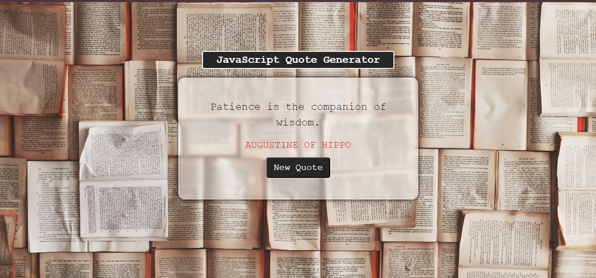
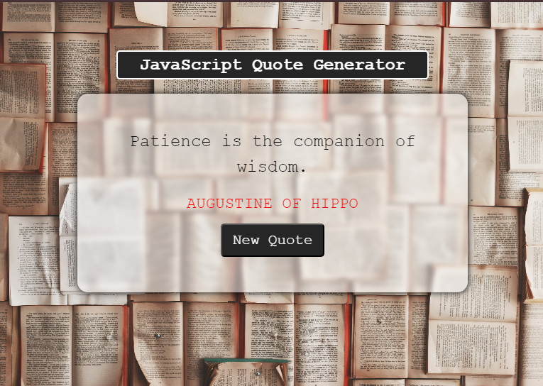
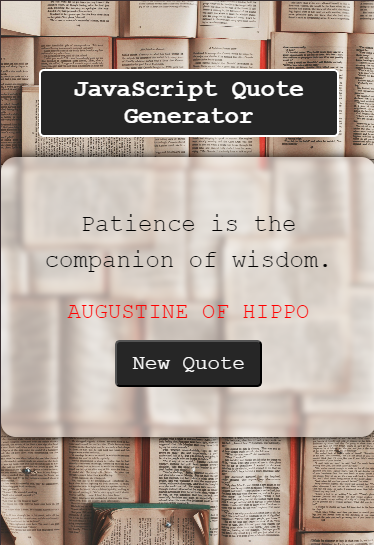

<!DOCTYPE html>
<html lang="en">
<body>
  <h1>Quote Generator</h1>
  
This project on Quote Generator is based on generating quote using wed api in Javascript.

  
  <h2>Features</h2>
  <ul>
      <li>Generate new quote functionality</li>
      <li>Displays Author and its famous quote.</li>
      <li>The basic desgin layout Desgined by Me </li>
 </ul>

 
  <h2>Language and Tools</h2>
  
Build with basic HTML ,CSS and JavaScript. 

  <h2>Learning</h2>
   <ul>
      <li>DOM Manuplation in Javascript</li>
      <li>Understand Event handling </li>
      <li>Use Api for Efficiency and Scalability</li>
 </ul>
  
  <h2>Website Link</h2>
  
<a href="https://quote-generator-khushiwala.vercel.app/">quote-generator-khushiwala.vercel.app</a>

 

  <h2>Preview Images</h2>

  
Here are previews on various screen sizes:

  <figure>
    <figcaption><b>Desktop Preview</b></figcaption>
    
  </figure>
  <figure>
      <figcaption><b>Tablet Preview</b></figcaption>
    
  </figure>
  <figure>
      <figcaption><b>Mobile Preview</b></figcaption>
    
  </figure>

  <i><b>
Happy coding!Thankyou
</b></i>
</body>
</html>

